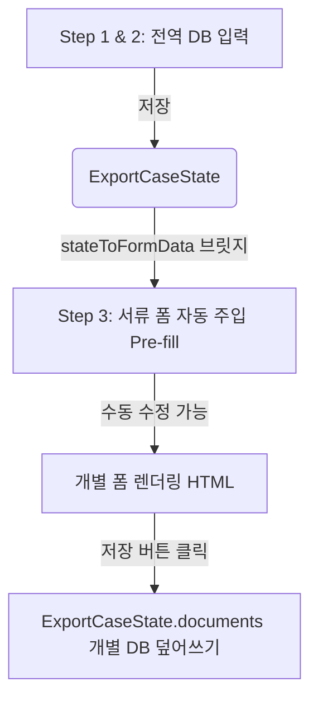

# 27종 서류 DB 매핑 및 데이터 흐름 분석 보고서

CP 수출통제 시스템 내의 27종 서류 양식(별지 서식)에 입력되는 데이터가 중앙 데이터베이스(`ExportCaseState`)와 어떻게 매핑되고 저장되는지 전수 조사하여 정리한 명세서입니다.

---

## 1. 데이터 파이프라인 아키텍처 (Data Flow)

시스템은 '데이터의 단일 진실 공급원(Single Source of Truth)' 원칙에 따라, 정보를 중복 입력하지 않고도 27종 서류 전체로 퍼져나가도록 설계되었습니다.



1. **초기 주입 (Pre-fill)**: 1, 2단계에서 입력된 `ExportCaseState`의 공통 정보(바이어 주소, 판정 결과 등)는 `stateToFormData()` 함수를 거쳐 개별 서류 템플릿(`formTemplates.js`)이 요구하는 키(Key)값으로 자동 치환되어 초기값으로 주입됩니다.
2. **개별 저장 (Save)**: 서류 작성(모달)에서 사용자가 특정 폼만 특수하게 수정(예: 수량, 금액, 사유 등)하고 저장하면, 그 결과는 `ExportCaseState.documents[서류ID].formData`에 독립적으로 저장됩니다.

---

## 2. 핵심 필드 매핑 구조 (DB ➔ 개별 양식)

현재 `formTemplates.js` 내부의 `<input data-field="...">` 소스코드를 전수 조사한 결과, 중앙 DB와 서류 양식 간의 매핑 규칙은 다음과 같습니다.

### 🏢 당사자 정보 (Parties)
| 전역 DB (ExportCaseState) | 브릿지 변환 키 (Form Data Key) | 연결되는 양식 (서류) |
| :--- | :--- | :--- |
| `parties.buyer.name` | `buyerName`, `buyer` | G-01(사전심사), K-01(사전보고), J-01(자진신고) 등 |
| `parties.buyer.address` | `buyerAddress` | 전 서식 공통 |
| `parties.ultimateConsignee.name` | `consigneeName`, `consignee` | K-01(사전보고), K-02(사후보고), L-01(개별허가) |
| `parties.endUser.name` | `endUserName`, `endUser`, `euCompany` | 서약서(DOC-ENDUSER), J-01, H-01 등 |
| `parties.agent.name` | `exporter` (대행 시) | H-01, M-01 등 |

### 🛡️ 품목 및 판정 정보 (Classification / F-04)
| 전역 DB (ExportCaseState) | 브릿지 변환 키 (Form Data Key) | 연결되는 양식 (서류) |
| :--- | :--- | :--- |
| `classification.computedEccn` | `controlNo` (통제번호) | F-01/02(판정서), L-01~03(허가신청), J-01(자진신고) |
| `classification.hskCode` | `hsCode` | 전 서식 공통 |
| `classification.productName` | `itemName`, `itemSpec`, `brokerageItem` | L-04~09(상황허가 패키지), K-01, K-02 등 |
| `classification.trackingId` | `classNo`, `issueNo`, `selfClassRegNo`| F-01(자가판정 등록번호), K-01(사전보고 판정번호) |

### 🌍 거래 환경 및 메타데이터 (Transaction & Meta)
| 전역 DB (ExportCaseState) | 브릿지 변환 키 (Form Data Key) | 연결되는 양식 (서류) |
| :--- | :--- | :--- |
| `destination.countryCode` | `destCountry` | K-01, K-02, J-01, L-01 |
| `status` | (상태 표출용) | Z-01(가상시뮬레이터), H-01 |
| `id` | `docNumber` | 서류 내부 관리 번호 |

---

## 3. 현행 소스코드 상의 개선점 (Action Item)

소스코드를 전수 검토한 결과, 현재 `stateToFormData` 브릿지 함수(complianceRuleEngine.ts)에서 내려주는 키 이름과 실제 `formTemplates.js`가 기대하는 키 이름 사이에 **일부 불일치(Mismatch)**가 존재하여, 완벽한 100% Pre-fill이 이뤄지지 않고 있습니다.

> [!WARNING]
> - 브릿지는 `eccn`이라는 키로 내려주나, 양식은 `controlNo`를 요구함.
> - 브릿지는 `productName`을 내려주나, 양식은 `itemName` 및 `itemSpec`을 요구함.
> - `buyerName`과 `buyer`가 양식별로 혼용되어 사용 중임.

### 💡 해결 방안: 완벽한 브릿지 함수 업데이트
이를 해결하기 위해, `complianceRuleEngine.ts`의 브릿지 함수를 아래와 같이 수정하여 파편화된 양식 키들을 모두 커버하도록 동기화해야 합니다.

```typescript
export function stateToFormData(docId: string, state: ExportCaseState): any {
  return {
    // 1. 당사자 매핑 (다중 키 지원)
    buyer: state.parties.buyer.name,
    buyerName: state.parties.buyer.name,
    buyerAddress: state.parties.buyer.address,
    consignee: state.parties.ultimateConsignee.name,
    consigneeName: state.parties.ultimateConsignee.name,
    endUser: state.parties.endUser.name,
    endUserName: state.parties.endUser.name,
    euCompany: state.parties.endUser.name,
    
    // 2. 판정 정보 매핑 (다중 키 지원)
    controlNo: state.classification.computedEccn || '',
    hsCode: state.classification.hskCode,
    itemName: state.classification.productName || '',
    itemSpec: state.classification.productName || '',
    classNo: state.classification.trackingId || '',
    issueNo: state.classification.trackingId || '',
    selfClassRegNo: state.classification.trackingId || '',
    kostiNumber: state.classification.kostiNumber || '',
    
    // 3. 메타데이터
    destCountry: state.destination.countryCode || '',
  };
}
```
위와 같이 매핑 로직을 정교화하면, 27종 서류를 열었을 때 모든 공통 필드에 데이터가 100% 자동으로 박히게 되어 업무 효율성이 극대화됩니다.


# 전사 CP 데이터 동기화 및 분기 처리 플로우차트

각 서류 양식에서 입력되는 데이터가 1) **어떻게 다른 서류로 동기화(Pre-fill)** 되는지, 2) **어떤 분기 조건(Branching Logic)**을 발동시켜 전체 시스템의 흐름을 바꾸는지 보여주는 마스터 다이어그램입니다.

## 🎨 범례 (Legend)
- 🟩 **녹색 (Synchronized Data)**: 한 번 입력하면 전체 서류 양식에 자동으로 동기화(주입)되는 공통 메타데이터.
- 🟥 **빨간색 (Branching Data)**: 서류의 활성화/비활성화 및 수출 차단(Stop-Shipment) 등을 결정짓는 치명적인 조건 데이터.
- 🟦 **파란색 (Documents)**: 실제 렌더링되는 서류 양식(폼).

---



```mermaid
graph TD
    classDef sync fill:#d1fae5,stroke:#059669,stroke-width:2px,color:#064e3b;
    classDef branch fill:#fee2e2,stroke:#dc2626,stroke-width:2px,color:#7f1d1d;
    classDef doc fill:#e0f2fe,stroke:#0284c7,stroke-width:2px,color:#0c4a6e;
    classDef block fill:#f3f4f6,stroke:#9ca3af,stroke-width:1px;

    %% STEP 1: 스크리닝
    subgraph Step1["Step 1: 거래 당사자 스크리닝 (Screening)"]
        G01["G-01 수출거래 사전심사표"]:::doc
        
        D_Parties["동기화: 당사자 정보 (buyerName 등)"]:::sync
        D_Dest["분기: 목적국 등급 (isGroupA 등)"]:::branch
        D_RedFlag["분기: 위험요소 (hasRedFlags 등)"]:::branch

        G01 --> D_Parties
        G01 --> D_Dest
        G01 --> D_RedFlag
        
        D_RedFlag -->|"위험요소 존재 시"| G04["G-04 절차중단 보고서"]:::doc
        D_RedFlag -->|"위험요소 존재 시"| L03["L-03 상황허가신청서"]:::doc
    end

    %% STEP 2: 판정
    subgraph Step2["Step 2: 판정대장 (Classification)"]
        F04["F-04 전략물자 판정대장"]:::doc
        F01["F-01 자가판정서"]:::doc
        F02["F-02 전문판정서"]:::doc

        D_ClassMeta["동기화: 판정 공통 정보 (trackingId 등)"]:::sync
        D_EAR["분기: US EAR 통제 여부 (isUsEarSubject)"]:::branch
        D_ECCN["분기: 전략물자 판정결과 (computedEccn)"]:::branch

        F04 --> D_ClassMeta
        F04 --> F01
        F04 --> F02
        
        F01 --> D_EAR
        F01 --> D_ECCN
        F02 --> D_ECCN
        
        D_EAR -->|"EAR 적용 시"| BlockF01["자가판정 불가 원천차단"]:::block
        BlockF01 -.-> F01
    end
    
    %% STEP 3: 인허가
    subgraph Step3A["Step 3: 인허가 서류 분기"]
        D_ECCN -->|"'5D002' / 'ML21'"| F03["F-03 기술사양 분석서"]:::doc
        
        D_ECCN -->|"'5D002' & 가지역 아님"| L01["L-01 개별수출허가신청서"]:::doc
        D_ECCN -->|"'5D002' & 가지역 & CP AA"| L02["L-02 포괄수출허가신청서"]:::doc
        
        D_Dest -->|"isSanctionedCountry = true"| BlockL02["L-02 포괄허가 원천차단"]:::block
        BlockL02 -.-> L02
    end
    
    %% STEP 3: 패키지
    subgraph Step3B["Step 3: 거래 형태별 패키지 연동"]
        D_ITT["분기: 무형기술이전 (isITT)"]:::branch
        D_Comp["분기: 부분품 수출 (isComponent)"]:::branch
        
        L03 --> L05["L-05~L-08 상황허가 부속서류 패키지"]:::doc
        L03 --> D_ITT
        L03 --> D_Comp
        
        D_ITT -->|"isITT = true"| L04["L-04 무형이전 부속서류"]:::doc
        D_Comp -->|"isComponent = true"| L09["L-09 부분제품 설명서"]:::doc
    end

    %% STEP 3: 특례
    subgraph Step3C["Step 3: 러시아/벨라루스 허가면제 특례"]
        D_Exempt["분기: 허가면제 적용 (isLicenseExempt)"]:::branch
        D_RU["분기: 러/벨 특례 (isRussiaBelarus)"]:::branch
        
        D_Exempt --> K01["K-01 사전거래보고서"]:::doc
        D_Exempt --> K02["K-02 사후거래보고서"]:::doc
        
        D_Exempt --> D_RU
        D_RU -->|"러/벨 특례건"| BlockK02["K-02 사후보고 불인정"]:::block
        BlockK02 -.-> K02
    end

    %% STEP 4: 비상조치
    subgraph Step4["Step 4: 사후 관리 및 비상 조치"]
        D_Revoke["분기: 비상사태 가동 (status = REVOKED)"]:::branch
        
        D_Revoke --> J01["J-01 자진신고서"]:::doc
        D_Revoke --> J02["J-02 재발방지계획서"]:::doc
    end
    
    %% Data Flow Links
    D_Parties -.-|"자동 채움"| L01
    D_Parties -.-|"자동 채움"| L02
    D_Parties -.-|"자동 채움"| K01
    D_Parties -.-|"자동 채움"| J01
    
    D_ClassMeta -.-|"자동 채움"| F03
    D_ClassMeta -.-|"자동 채움"| L01
    D_ClassMeta -.-|"자동 채움"| L02
    D_ClassMeta -.-|"자동 채움"| L03
```

## 📊 상세 설명 (Detailed Explanation)

### 1. 🟩 녹색: 단순 동기화 데이터 (Pre-fill Data)
단순히 양식의 빈칸을 채우는 역할을 하며, 활성화/비활성화 로직에 영향을 주지는 않지만 중복 입력을 막아주어 시스템 효율을 높이는 핵심 데이터입니다.
- **당사자 정보 (D_Parties)**: G-01(사전심사표)에서 최초 기입되는 구매자, 최종수하인, 최종사용자의 상호명, 주소, 국가 코드가 `ExportCaseState`에 저장된 후, K-01(보고서)부터 J-01(자진신고서)까지 거의 모든 양식에 `buyer`, `consigneeName` 등의 키로 100% 덮어씌워집니다.
- **판정 공통 메타 (D_ClassMeta)**: F-04 판정대장에서 생성/입력되는 관리번호, HSK 코드, 품목명, 판정일자는 서류 렌더링 시 L-01 등 인허가 서류 상의 `hsCode`, `itemName` 등으로 주입됩니다.

### 2. 🟥 빨간색: 핵심 분기 데이터 (Branching Logic Data)
시스템의 플로우를 극적으로 바꾸고, 서류 목록을 보이게 하거나 숨기는 엔진(`complianceRuleEngine.ts`)의 스위치 역할을 합니다.
- **D_ECCN (판정결과)**: 이 값이 `5D002`냐 `EAR99`냐에 따라 3단계 인허가 폼이 `L-01(개별)` / `L-02(포괄)` / `L-03(상황)` 중 어느 쪽으로 흘러갈지 완벽하게 나뉩니다.
- **D_Dest (목적국)**: 바이어의 국가가 `isSanctionedCountry`(제재국)인 경우, 아무리 등급이 높아도(CP AA) L-02(포괄허가) 작성을 원천 차단(Block)합니다.
- **D_RedFlag (의심징후)**: 스크리닝에서 12대 의심징후나 우려거래자가 하나라도 체크되면 전체 출하가 보류되며 `G-04(절차중단보고서)`와 `L-03(상황허가)` 트랙이 강제 활성화됩니다.
- **D_ITT / D_Comp / D_RU**: L-03이 열려있을 때 무형이전 여부(`isITT`)를 켜면 L-04가 추가로 열리고, 러시아 수출건(`isRussiaBelarus`)이면 사후보고(K-02)가 강제로 닫히고 사전보고(K-01)로 대체되는 등 매우 세밀한 패키지 결합을 관장합니다.
